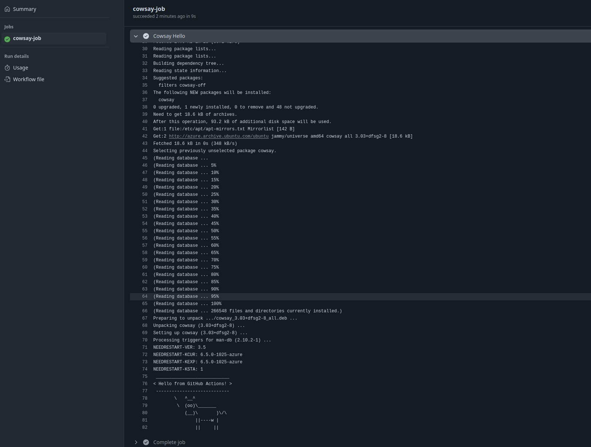

---
tags:
  - Github Action
---

# Github action

Github action est une plateforme d'intégration continue et livraison continue (CI/CD). Elle va permettre de prendre en compte une modification de code et d'automatiser des recettes jusqu'a ce que le code tourne en production.

C'est le coeur de métier du DevOps, c'est via ce genre d'outil qu'on peut à la fois préparer/vérifier/contrôler le code et le déployer sur la production pour que les modifications du développeur soient prise en compte.

Github Action est récent et est sorti bien après Github (2019), avant cela on était obligé d'utiliser des outils tier d'intégration continu comme par exemple CircleCI.

Github Action va permettre d'écrire des recettes un peu comme avec Ansible et de les déclencher en fonction d'évenements particuliers comme par exemple un push sur la branche remote `main`.

Il diffère d'Ansible dans de nombreux aspects, en particulier son rôle premier qui n'est pas de configurer des serveurs, mais de déployer des applications, ce n'est donc pas lui qui vous permettra d'installer ou de paramétrer par exemple un serveur Apache.

## Les événements (event)

Les événements vont être des activités repérées sur le dépôt Github, classiquement un git push main, mais aussi plein d'autres évenements configurable et paramétrable.

C'est le point de départ de vos recettes, vous ne pouvez pas les lancer directement comme vous le faisiez avec ansible-playbook par exemple : vous devez donc dans vos recettes indiquer à quel(s) évenement(s) se connecter.

Consultez la liste des évenements sur la [doc officielle](https://docs.github.com/fr/actions/writing-workflows/choosing-when-your-workflow-runs/events-that-trigger-workflows)

Regardez l'évenement `push` et m'évenement `schedule`.

## Le fichier de recette (workflow)

Pour créer une recette Github action il faut créer un fichier ici : `.github/workflows/`, il doit utiliser le suffixe `.yml` car c'est un fichier Yaml.

Par exemple :

```
code .github/workflows/ma-recette.yml
```

On peut y définir autant de recette qu'on veut, le répertoire est obligatoire et non paramétrable, donc sur n'importe quel dépôt Github public vous pouvez consulter l'ensemble des recettes Github Action en listant le répertoire `.github/workflows/`

Le fichier de recette va indiquer à la fois le ou les évenements sur lesquels il se déclenche et une liste de travaux (job) qu'il va exécuter (voir ci dessous).

## Les travaux (job)

Les travaux sont un ensemble d'étapes à exécuter quelque part, c'est ce qui ressemble le plus à la recette ansible que vous avez pratiqué par le passé.

On définit ce que l'ont fait et où est ce qu'on le fait. Chaque action du job est referencée par une étape (step), ce qui correspond exactement aux tasks d'Ansible.

Plusieurs steps sont lancé par un même job et plusieurs jobs peuvent être lancé par un même workflow.

Un exemple de job pourrait par exemple récuperer le code de l'application et le copier dans le répertoire /var/www/ d'un serveur de production.

## Les étapes (step)

Ce sont chaque petite tâche individuelle exécutée par un travail (job), elles utilisent ce qu'on appelle des actions disponible via le github marketplace.

Visualisez les différentes actions [ici](https://github.com/marketplace?verification=verified_creator&type=actions)

Elles sont très nombreuses et au final on utilise souvent les même, voici une liste d'action à connaitre :

- [Checkout](https://github.com/marketplace/actions/checkout), pour récuperer le code de l'application en lui même.
- [Super-Linter](https://github.com/marketplace/actions/super-linter), pour vérifier la qualité de votre code.
- [Docker Build and Push](https://github.com/marketplace/actions/build-and-push-docker-images), pour builder une image Docker
- [Release Please](https://github.com/marketplace/actions/release-please-action) pour générer des belles release grâce aux conventionnal commit.

chaque step peut aussi tout simplement exécuter une commande via `run` cela permet d'exécuter des commandes sur l'exécuteur distant.

## L'exécuteur (runner)

Nos jobs sont exécuté quelque part, sur un serveur. Ce serveur est appelé l'exécuteur (runner).

Github met à disposition, de manière limité, des serveurs virtuels (vm's) pour exécuter nos jobs. Ce peut être un Linux, un Windows et même un macos. Cependant dans la plupart des cas nous utiliseront Linux (Ubuntu). Concretement ces VM tournent dans l'infrastructure Cloud Azure de Microsoft.

Pour éviter les abus leur usage est donc limité.

On peut aussi utilisé ce qu'on appelle des exécteur auto-hébergé : les **local runner**, en gros un installe un petit soft sur un de nos serveurs à nous et Github Action va y exécuter certaines actions.

L'utilisation du local runner a deux gros avantages :

- pas de limitation de ressources,
- pouvoir s'en servir pour déployer sur notre production finale.

Un job s'exécute sur un seul runner, il faut donc spécifier le runner dans le job en question. Un workflow pouvant exécuter plusieurs jobs, il peut lancer des actions dans plusieurs serveurs et environnements.

## Mise en pratique simple

Le but ici est d'écrire notre premier workflow et de visualiser son exécution.

```
name: Cowsay Workflow

# Le workflow se déclenchera quand on fera un git push sur main
on:
  push:
    branches:
      - main

jobs:
  cowsay-job:
    runs-on: ubuntu-latest

    steps:
      # Étape pour afficher une vache avec cowsay
      - name: Cowsay Hello
        run: |
          sudo apt-get update
          sudo apt-get install -y cowsay
          cowsay "Hello from GitHub Actions!"
```

Sauvegardez le contenu de ce fichier dans `.github/workflows/cowsay.yml`

Puis un simple push déclenchera son exécution.

Retrouvez dans l'interface Github l'exécution et l'affichage de la vache en asciiart, vous devriez retrouver quelque chose comme ça :

